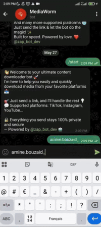

<h1 align="left">ZapBot ⚡</h1>
<p align="center">
  <a href="https://t.me/MediawormBot">
    
  </a>
</p>

<p align="center">
  <i>Your Ultimate Media Downloader Bot</i><br>
  <b>Download anything. Anywhere. Fast & Easy! ⚡</b>
</p>

<p align="center">
  <a href="https://t.me/MediawormBot">
    
  </a>
</p>


<p align="left">
  We all love downloading videos for offline access... but most tools are slow, full of ads, or simply don’t work anymore.

This repo is a Multi-Platform Video & Audio Downloader Bot — reimagined as a blazing-fast Telegram Bot ⚡️

No ads. No confusion. Just paste your link and get your video or audio in seconds.
It works beautifully on over 10 platforms like:

🎥 YouTube, TikTok, Instagram, Facebook, Twitter, Vimeo, Dailymotion, SoundCloud, TED, and more...

<p/>
  

---

## 🚀 Features

- 🎵 **SoundCloud & TED**: Download as `audio`.
- 📺 **YouTube & Dailymotion**: Download long videos as `video` or `audio`.
- 🎥 **TikTok, Facebook, Twitter, etc.**: Download as `audio`.
- 📸 **Instagram**:
  - Download `posts`, `highlights`, `stories`, and `profile info`.
  - Fetch latest data from any user using their username.

---

## ⚙️ System Features

- 💰 **Donation System**: Can be `activated` or `deactivated`.
- 🔐 **Request Limiter**: For security and abuse prevention.
- 🚫 **User Request Limiter**: Protects from spam attacks.
- 📢 **Channel Subscription System**: Can be enabled to require users to join a channel before using the bot.

<p align="center">
  
</p>
---

## 🚀 How to Use

1. Start the bot 👉 [@zap_bot_dev](https://t.me/zap_bot_dev)  
2. Send a valid media link (Instagram, YouTube...)  
3. Enjoy your download 😍

---

## 📦 Requirements

- Python 3.10+
- `python-telegram-bot`
- `yt-dlp`
- `flask`
- `requests`
- `python-dotenv`
- `bs4`

Install all dependencies:

```bash
pip install -r requirements.txt
